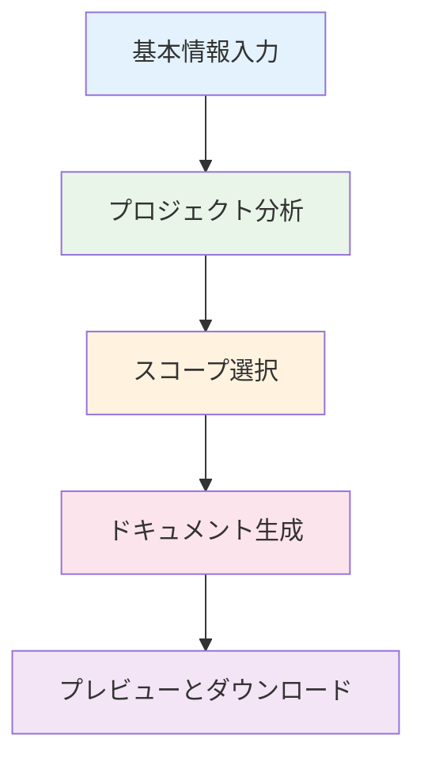

# REQUISITION Generator - Enhanced

自動車生産関連の設備導入プロジェクトにおける購入要求書（REQUISITION）の作成を半自動化するReactアプリケーション。

## 📋 概要

本ツールは、以下の目的で開発されました：
- 作成時間の短縮
- 記載漏れの防止
- 仕様の標準化・品質向上

## 🎯 対象ショップ

- 溶接（Welding）
- 塗装（Painting）
- 組立（Assembly）
- 検査（Inspection）

## 👥 利用者

- プロジェクトマネージャー
- 設備担当技術者

## ✨ 機能

### 基本版
- プロジェクト情報管理
- Excelファイルからの機器リスト読み込み
- 自動採番機能
- フローダイアグラムエディタ
- REQUISITIONプレビュー生成

### Enhanced版
1. **プロジェクト分析機能**
   - 必須要件、期待要件、性能要件の構造化入力
   - スケジュール管理（納期、マイルストーン）
   - 予算情報と制約条件の管理

2. **スコープ選択機能**
   - AI提案項目の選択UI
   - 追加・除外項目の入力
   - 優先度設定
   - 情報充足率の自動計算

3. **複数ドキュメント生成機能**
   - 購入要求書
   - 技術仕様書
   - コスト見積明細
   - リスク分析レポート
   - 各ドキュメントのダウンロード機能

4. **ステップバイステップ・ウィザード**
   - 直感的な進捗インジケーター
   - 5ステップの包括的ワークフロー

## 🚀 使い方

### 基本版
1. プロジェクト情報を入力
2. Excelから機器リストを読み込み
3. 採番ルールを設定
4. フローダイアグラムを作成
5. REQUISITIONをプレビュー・エクスポート

### Enhanced版
1. **基本情報**: プロジェクト情報と機器リストを入力
2. **分析**: 要求事項、スケジュール、予算を詳細設定
3. **スコープ**: AI提案項目から生成範囲を選択
4. **生成**: 複数ドキュメントを自動生成
5. **プレビュー**: 完成したドキュメントを確認・ダウンロード

## 🛠️ 技術スタック

- **フレームワーク**: React 18.3.1
- **ビルドツール**: Vite 5.4.20
- **CSS**: Tailwind CSS 3.4.13
- **主要ライブラリ**:
  - Mermaid (フローダイアグラム)
  - PapaParse (Excel読み込み)
  - XLSX (Excel処理)
  - React Markdown (Markdown表示)

## 📦 インストール

```bash
# 依存関係のインストール
npm install

# 開発サーバーの起動
npm run dev

# ビルド
npm run build

# プレビュー
npm run preview
```

## 📁 プロジェクト構成

```
project-spec-generator/
├── src/
│   ├── components/
│   │   ├── ProjectInfoForm.jsx       # プロジェクト情報フォーム
│   │   ├── ProjectAnalysis.jsx       # プロジェクト分析機能
│   │   ├── ExcelUploader.jsx         # Excel読み込み
│   │   ├── NumberingConfig.jsx       # 採番設定
│   │   ├── EquipmentList.jsx         # 機器リスト
│   │   ├── FlowDiagramEditor.jsx     # フローダイアグラム編集
│   │   ├── ScopeSelector.jsx         # スコープ選択
│   │   ├── MultiDocumentGenerator.jsx # 複数ドキュメント生成
│   │   ├── RequisitionPreview.jsx    # REQUISITIONプレビュー
│   │   └── PromptViewer.jsx          # プロンプト仕様表示
│   ├── utils/
│   │   └── numberingEngine.js        # 採番エンジン
│   ├── App.jsx                       # メインアプリケーション
│   ├── main.jsx                      # エントリーポイント
│   └── index.css                     # スタイル
├── public/
├── package.json
└── README.md
```

## 🔄 Enhanced版のワークフロー



## 📄 REQUISITIONの構成

### 本体書類の章構成
1. **プロジェクト概要**
2. **適用範囲・スコープ**
3. **設備仕様**
   - 全体レイアウト
   - ライン構成（フロー図形式）
   - 機器リスト
   - 個別機器性能
   - メカ配置レイアウト
   - 制御システムダイアグラム
4. **プロジェクトスケジュール**
5. **責任範囲**
6. **検収条件**
7. **特記事項**
8. **組織表**

### Enhanced版で生成される追加ドキュメント
- **技術仕様書**: 詳細な技術要件とシステム構成
- **コスト見積明細**: 機器、ソフトウェア、開発費用の内訳
- **リスク分析レポート**: プロジェクトリスクと対策案

## 🌐 アクセス

開発サーバー起動後、以下のURLでアクセスできます：
- **Local**: http://localhost:5173
- **Network**: http://172.28.32.1:5173 または http://10.85.214.34:5173

## 📝 更新履歴

### v1.1.0 (Enhanced版) - 2025-10-08
- ✨ プロジェクト分析機能を追加
- ✨ スコープ選択機能を実装
- ✨ 複数ドキュメント生成機能を追加
- ✨ ステップバイステップ・ウィザードを導入
- 🎨 UI/UXの改善
- 📱 レスポンシブデザインの最適化

### v1.0.0 (基本版) - 2025-10-08
- 🎉 初版リリース
- 📋 基本的なREQUISITION生成機能
- 📊 Excel読み込み機能
- 🔢 自動採番機能
- 📈 フローダイアグラム編集機能

## 🤝 貢献

1. リポジトリをフォーク
2. 機能ブランチを作成 (`git checkout -b feature/AmazingFeature`)
3. 変更をコミット (`git commit -m 'Add some AmazingFeature'`)
4. ブランチにプッシュ (`git push origin feature/AmazingFeature`)
5. プルリクエストを作成

## 📄 ライセンス

本プロジェクトは社内利用を目的としています。

## 📞 サポート

ご不明な点や問題がございましたら、開発チームまでご連絡ください。

---

*本アプリはREQUISITION Generator Enhancedにより開発されました。*